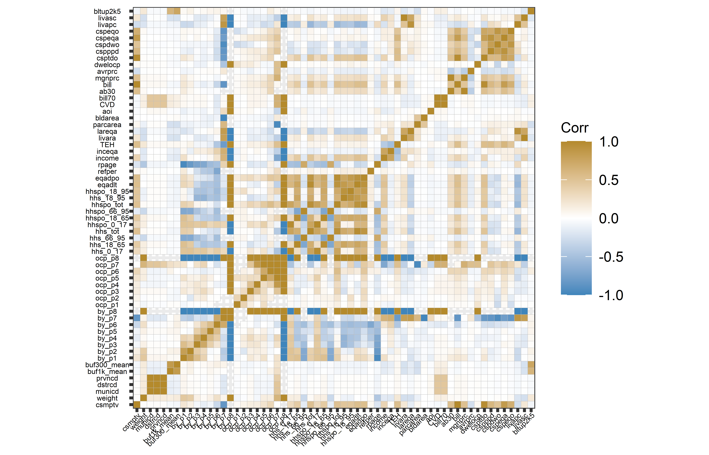
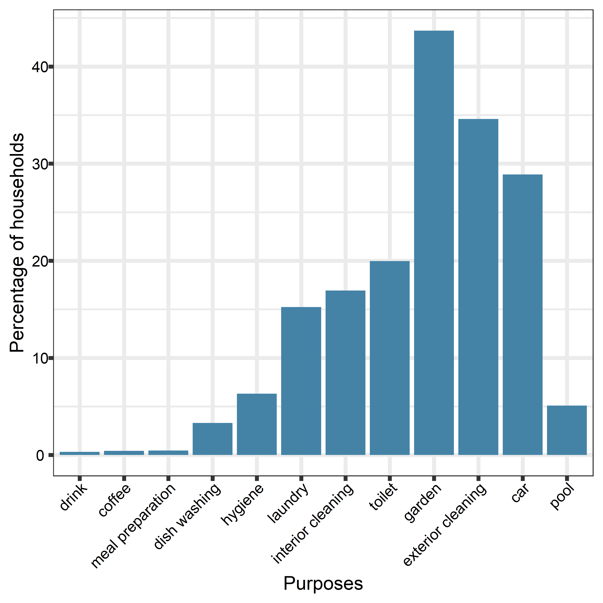
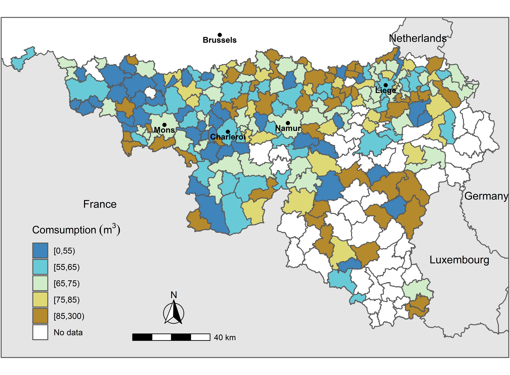

Household level determinants
================
Nguyen Bich Ngoc, Cedric Prevedello, Mario Cools, Jacques Teller
01 February 2022

    ## Warning in wtd.var(x, na.rm = T, us$weight): only one effective observation; variance
    ## estimate undefined

    ## Warning in wtd.var(x, na.rm = T, us$weight): only one effective observation; variance
    ## estimate undefined

| variable    |          mean |           sd |           min |          max | missing |
|:------------|--------------:|-------------:|--------------:|-------------:|--------:|
| id          |  1428.3021243 | 8.497492e+02 |     5.0000000 |  2911.000000 |       0 |
| qnb         | 15570.3847176 | 9.974083e+03 |  -100.0000000 | 63112.000000 |       6 |
| mvinyr      |  1997.0136131 | 1.657064e+01 |  1900.0000000 |  2015.000000 |      36 |
| csmptv      |    69.3147189 | 4.438897e+01 |     0.0000000 |   523.950000 |     156 |
| weight      |     1.4645399 | 1.027296e+00 |     0.2777410 |     6.030826 |       0 |
| municd      | 60785.0475326 | 1.728732e+04 | 25005.0000000 | 93090.000000 |     140 |
| dstrcd      | 60732.9677778 | 1.728470e+04 | 25000.0000000 | 93000.000000 |     140 |
| prvncd      | 57615.3279519 | 1.806475e+04 | 20002.0000000 | 90000.000000 |     140 |
| regicd      |  3000.0000000 | 0.000000e+00 |  3000.0000000 |  3000.000000 |     140 |
| buf1k_mean  |     1.2560320 | 8.260360e-01 |     0.0283385 |     3.741525 |     140 |
| buf300_mean |     1.7791160 | 9.611655e-01 |     0.0000000 |     4.869504 |     140 |
| by_p1       |  1962.1282346 | 1.674243e+01 |  1919.0000000 |  2013.000000 |     146 |
| by_p2       |  1969.5326546 | 1.928463e+01 |  1920.0000000 |  2014.000000 |     588 |
| by_p3       |  1997.4848448 | 1.326418e+01 |  1922.0000000 |  2015.000000 |    1428 |
| by_p4       |  2000.7340802 | 1.183951e+01 |  1923.0000000 |  2015.000000 |    1713 |
| by_p5       |  2003.7662070 | 1.034038e+01 |  1930.0000000 |  2015.000000 |    1971 |
| by_p6       |  2004.3188703 | 1.106837e+01 |  1945.0000000 |  2015.000000 |    2074 |
| by_p7       |  2001.4289782 | 1.233088e+01 |  1984.0000000 |  2014.000000 |    2113 |
| by_p8       |  2005.4246721 | 4.507285e+00 |  2001.0000000 |  2007.000000 |    2117 |
| by_p9       |  2003.0000000 | 0.000000e+00 |  2003.0000000 |  2003.000000 |    2118 |
| ocp_p1      |     0.9855867 | 8.701390e-02 |     0.2500000 |     1.000000 |     245 |
| ocp_p2      |     0.9638522 | 1.403527e-01 |     0.2500000 |     1.000000 |     658 |
| ocp_p3      |     0.9111069 | 2.174442e-01 |     0.2500000 |     1.000000 |    1450 |
| ocp_p4      |     0.9306512 | 1.971992e-01 |     0.2500000 |     1.000000 |    1722 |
| ocp_p5      |     0.9460647 | 1.674032e-01 |     0.2500000 |     1.000000 |    1972 |
| ocp_p6      |     0.9428839 | 1.840677e-01 |     0.2500000 |     1.000000 |    2074 |
| ocp_p7      |     0.9788554 | 7.278050e-02 |     0.7500000 |     1.000000 |    2110 |
| ocp_p8      |     0.9343613 | 1.878036e-01 |     0.7500000 |     1.000000 |    2117 |
| ocp_p9      |     0.7500000 | 0.000000e+00 |     0.7500000 |     0.750000 |    2118 |
| hhs_0\_17   |     0.5419094 | 9.402809e-01 |     0.0000000 |     5.000000 |     140 |
| hhs_18_65   |     1.5713648 | 1.051282e+00 |     0.0000000 |     6.000000 |     140 |
| hhs_66_95   |     0.3422338 | 6.649675e-01 |     0.0000000 |     3.000000 |     140 |
| hhs_tot     |     2.4569501 | 1.308901e+00 |     1.0000000 |     9.000000 |     141 |
| hhspo_0\_17 |     0.5199847 | 9.045408e-01 |     0.0000000 |     5.000000 |     248 |
| hhspo_18_65 |     1.5168842 | 1.001540e+00 |     0.0000000 |     6.000000 |     248 |
| hhspo_66_95 |     0.3244919 | 6.481726e-01 |     0.0000000 |     3.000000 |     248 |
| hhspo_tot   |     2.3613608 | 1.270091e+00 |     0.2500000 |     8.000000 |     248 |
| hhs_18_95   |     1.9154946 | 8.042980e-01 |     1.0000000 |     6.000000 |     141 |
| hhspo_18_95 |     1.8413761 | 7.718734e-01 |     0.0000000 |     6.000000 |     248 |
| eqadlt      |     1.6193721 | 5.186372e-01 |     0.8000000 |     4.100000 |     140 |
| eqadpo      |     1.5697038 | 5.157826e-01 |     0.2500000 |     4.100000 |     248 |
| refper      |     1.1783422 | 4.769233e-01 |     1.0000000 |     6.000000 |     141 |
| rpage       |    53.0904229 | 1.635975e+01 |    19.0000000 |    95.000000 |     141 |
| income      |  2460.9474802 | 1.190989e+03 |   125.0000000 |  5250.000000 |     109 |
| inceqa      | 18587.5439149 | 7.676862e+03 |   750.0000000 | 63000.000000 |     140 |
| TEH         |     1.4047539 | 1.037042e+00 |     0.2121840 |    13.102635 |     124 |
| livara      |   128.2172074 | 5.851555e+01 |    20.0000000 |   400.000000 |      22 |
| lareqa      |    83.6098794 | 4.043049e+01 |    13.7931034 |   345.000000 |     157 |
| parcarea    |   774.1521279 | 1.207271e+03 |    24.1683000 | 18214.998000 |     317 |
| bldarea     |   154.1949413 | 3.306194e+02 |     0.0000000 | 11948.254170 |     317 |
| aoi         |     0.8413150 | 1.060410e-01 |     0.5517647 |     1.000000 |       0 |
| CVD         |     2.4665206 | 1.008809e-01 |     2.1600000 |     2.636600 |      11 |
| CVA         |     1.7450000 | 0.000000e+00 |     1.7450000 |     1.745000 |      11 |
| bill70      |   326.4948910 | 8.020030e+00 |   302.1265000 |   340.016200 |      11 |
| ab30        |     0.8321619 | 3.738196e-01 |     0.0000000 |     1.000000 |     156 |
| bill        |   329.6484192 | 1.912580e+02 |   107.3886000 |  2348.654428 |     166 |
| mgnprc      |     3.9504699 | 1.178686e+00 |     1.1580500 |     4.657746 |     166 |
| avrprc      |     5.5409254 | 4.648701e+00 |     4.2002500 |   108.699290 |     167 |
| dwelocp     |     0.9509123 | 9.465180e-02 |     0.0000000 |     1.000000 |     208 |
| csptdo      |    74.3500810 | 4.779116e+01 |     0.0000000 |   523.950000 |     349 |
| cspppd      |    85.4627037 | 5.080249e+01 |     0.0000000 |   717.739726 |     287 |
| cspdwo      |    97.2323965 | 6.831816e+01 |     0.0000000 |   935.525114 |     463 |
| cspeqa      |   116.1523832 | 6.265605e+01 |     0.0000000 |   956.986301 |     287 |
| cspeqo      |   132.7565790 | 9.329574e+01 |     0.0000000 |  1293.209132 |     463 |
| livapc      |    64.2235384 | 4.042420e+01 |     6.6666667 |   345.000000 |     157 |
| livasc      |    -0.1714093 | 9.924797e-01 |    -2.0068766 |     4.438287 |      22 |
| bltup2k5    |   413.3682959 | 2.939042e+02 |     0.0000000 |  1663.000000 |     142 |

| vars               | levels                           | count |        freq |
|:-------------------|:---------------------------------|------:|------------:|
| prfuse             | no                               |  1989 |  93.8650307 |
| prfuse             | yes                              |   130 |   6.1349693 |
| uos_drink_bottle   | no                               |   969 |  45.7291175 |
| uos_drink_bottle   | yes                              |  1150 |  54.2708825 |
| uos_drink_rain     | no                               |  2112 |  99.6696555 |
| uos_drink_rain     | yes                              |     7 |   0.3303445 |
| uos_drink_well     | no                               |  2117 |  99.9056159 |
| uos_drink_well     | yes                              |     2 |   0.0943841 |
| uos_drink_other    | no                               |  2104 |  99.2921189 |
| uos_drink_other    | yes                              |    15 |   0.7078811 |
| uos_coffee_bottle  | no                               |  2029 |  95.7527135 |
| uos_coffee_bottle  | yes                              |    90 |   4.2472865 |
| uos_coffee_rain    | no                               |  2110 |  99.5752714 |
| uos_coffee_rain    | yes                              |     9 |   0.4247286 |
| uos_coffee_well    | no                               |  2116 |  99.8584238 |
| uos_coffee_well    | yes                              |     3 |   0.1415762 |
| uos_coffee_other   | no                               |  2111 |  99.6224634 |
| uos_coffee_other   | yes                              |     8 |   0.3775366 |
| uos_meal_bottle    | no                               |  2096 |  98.9145824 |
| uos_meal_bottle    | yes                              |    23 |   1.0854176 |
| uos_meal_rain      | no                               |  2109 |  99.5280793 |
| uos_meal_rain      | yes                              |    10 |   0.4719207 |
| uos_meal_well      | no                               |  2114 |  99.7640396 |
| uos_meal_well      | yes                              |     5 |   0.2359604 |
| uos_meal_other     | no                               |  2117 |  99.9056159 |
| uos_meal_other     | yes                              |     2 |   0.0943841 |
| uos_dishes_bottle  | no                               |  2118 |  99.9528079 |
| uos_dishes_bottle  | yes                              |     1 |   0.0471921 |
| uos_dishes_rain    | no                               |  2049 |  96.6965550 |
| uos_dishes_rain    | yes                              |    70 |   3.3034450 |
| uos_dishes_well    | no                               |  2110 |  99.5752714 |
| uos_dishes_well    | yes                              |     9 |   0.4247286 |
| uos_dishes_other   | no                               |  2115 |  99.8112317 |
| uos_dishes_other   | yes                              |     4 |   0.1887683 |
| uos_hyg_bottle     | no                               |  2119 | 100.0000000 |
| uos_hyg_rain       | no                               |  1985 |  93.6762624 |
| uos_hyg_rain       | yes                              |   134 |   6.3237376 |
| uos_hyg_well       | no                               |  2099 |  99.0561586 |
| uos_hyg_well       | yes                              |    20 |   0.9438414 |
| uos_hyg_other      | no                               |  2117 |  99.9056159 |
| uos_hyg_other      | yes                              |     2 |   0.0943841 |
| uos_washing_bottle | no                               |  2119 | 100.0000000 |
| uos_washing_rain   | no                               |  1796 |  84.7569608 |
| uos_washing_rain   | yes                              |   323 |  15.2430392 |
| uos_washing_well   | no                               |  2086 |  98.4426616 |
| uos_washing_well   | yes                              |    33 |   1.5573384 |
| uos_washing_other  | no                               |  2114 |  99.7640396 |
| uos_washing_other  | yes                              |     5 |   0.2359604 |
| uos_idclean_bottle | no                               |  2119 | 100.0000000 |
| uos_idclean_rain   | no                               |  1760 |  83.0580462 |
| uos_idclean_rain   | yes                              |   359 |  16.9419538 |
| uos_idclean_well   | no                               |  2082 |  98.2538933 |
| uos_idclean_well   | yes                              |    37 |   1.7461067 |
| uos_idclean_other  | no                               |  2113 |  99.7168476 |
| uos_idclean_other  | yes                              |     6 |   0.2831524 |
| uos_WC_bottle      | no                               |  2119 | 100.0000000 |
| uos_WC_rain        | no                               |  1696 |  80.0377537 |
| uos_WC_rain        | yes                              |   423 |  19.9622463 |
| uos_WC_well        | no                               |  2071 |  97.7347806 |
| uos_WC_well        | yes                              |    48 |   2.2652194 |
| uos_WC_other       | no                               |  2114 |  99.7640396 |
| uos_WC_other       | yes                              |     5 |   0.2359604 |
| uos_garden_bottle  | no                               |  2117 |  99.9056159 |
| uos_garden_bottle  | yes                              |     2 |   0.0943841 |
| uos_garden_rain    | no                               |  1193 |  56.3001416 |
| uos_garden_rain    | yes                              |   926 |  43.6998584 |
| uos_garden_well    | no                               |  2031 |  95.8470977 |
| uos_garden_well    | yes                              |    88 |   4.1529023 |
| uos_garden_other   | no                               |  2099 |  99.0561586 |
| uos_garden_other   | yes                              |    20 |   0.9438414 |
| uos_car_bottle     | no                               |  2119 | 100.0000000 |
| uos_car_rain       | no                               |  1507 |  71.1184521 |
| uos_car_rain       | yes                              |   612 |  28.8815479 |
| uos_car_well       | no                               |  2055 |  96.9797074 |
| uos_car_well       | yes                              |    64 |   3.0202926 |
| uos_car_other      | no                               |  2119 | 100.0000000 |
| uos_odclean_bottle | no                               |  2119 | 100.0000000 |
| uos_odclean_rain   | no                               |  1386 |  65.4082114 |
| uos_odclean_rain   | yes                              |   733 |  34.5917886 |
| uos_odclean_well   | no                               |  2047 |  96.6021708 |
| uos_odclean_well   | yes                              |    72 |   3.3978292 |
| uos_odclean_other  | no                               |  2099 |  99.0561586 |
| uos_odclean_other  | yes                              |    20 |   0.9438414 |
| uos_pool_bottle    | no                               |  2119 | 100.0000000 |
| uos_pool_rain      | no                               |  2011 |  94.9032563 |
| uos_pool_rain      | yes                              |   108 |   5.0967437 |
| uos_pool_well      | no                               |  2102 |  99.1977348 |
| uos_pool_well      | yes                              |    17 |   0.8022652 |
| uos_pool_other     | no                               |  2110 |  99.5752714 |
| uos_pool_other     | yes                              |     9 |   0.4247286 |
| pvwlbn             | no                               |  2018 |  95.2336008 |
| pvwlbn             | yes                              |   101 |   4.7663992 |
| pvwlid             | no                               |  2058 |  97.1212836 |
| pvwlid             | yes                              |    61 |   2.8787164 |
| pvwlod             | no                               |  2024 |  95.5167532 |
| pvwlod             | yes                              |    95 |   4.4832468 |
| prvwel             | no                               |  2018 |  95.2336008 |
| prvwel             | outdoor                          |    40 |   1.8876829 |
| prvwel             | indoor                           |     6 |   0.2831524 |
| prvwel             | both                             |    55 |   2.5955639 |
| rwtank             | no                               |  1270 |  59.9339311 |
| rwtank             | yes                              |   849 |  40.0660689 |
| rwtkrp             | no                               |  2033 |  95.9414818 |
| rwtkrp             | yes                              |    86 |   4.0585182 |
| rwusbn             | no                               |  1111 |  52.4303917 |
| rwusbn             | yes                              |  1008 |  47.5696083 |
| rwusid             | no                               |  1576 |  74.3747050 |
| rwusid             | yes                              |   543 |  25.6252950 |
| rwusod             | no                               |  1135 |  53.5630014 |
| rwusod             | yes                              |   984 |  46.4369986 |
| rwtuse             | no                               |  1111 |  52.4303917 |
| rwtuse             | outdoor                          |   465 |  21.9443134 |
| rwtuse             | indoor                           |    24 |   1.1326097 |
| rwtuse             | both                             |   519 |  24.4926852 |
| otsrid             | no                               |  1495 |  70.5521472 |
| otsrid             | yes                              |   624 |  29.4478528 |
| otsrod             | no                               |  1024 |  48.3246815 |
| otsrod             | yes                              |  1095 |  51.6753185 |
| prvnnm             | Brabant Wallon                   |   278 |  13.1193959 |
| prvnnm             | Hainaut                          |   738 |  34.8277489 |
| prvnnm             | Liege                            |   603 |  28.4568193 |
| prvnnm             | Luxembourg                       |   114 |   5.3798962 |
| prvnnm             | Namur                            |   246 |  11.6092496 |
| prvnnm             | missing                          |   140 |   6.6068900 |
| reginm             | Walloon region                   |  1979 |  93.3931100 |
| reginm             | missing                          |   140 |   6.6068900 |
| dtbtor             | SWDE                             |  1567 |  73.9499764 |
| dtbtor             | CILE                             |   329 |  15.5261916 |
| dtbtor             | inBW                             |   167 |   7.8810760 |
| dtbtor             | INASEP                           |    44 |   2.0764512 |
| dtbtor             | Theux                            |     1 |   0.0471921 |
| dtbtor             | missing                          |    11 |   0.5191128 |
| pointsp            | 0                                |    78 |   3.6809816 |
| pointsp            | 1                                |   282 |  13.3081642 |
| pointsp            | 2                                |   726 |  34.2614441 |
| pointsp            | 3                                |   610 |  28.7871638 |
| pointsp            | 4                                |   251 |  11.8452100 |
| pointsp            | 5                                |    29 |   1.3685701 |
| pointsp            | missing                          |   143 |   6.7484663 |
| buf1k_mode         | 0                                |  1519 |  71.6847570 |
| buf1k_mode         | 1                                |     1 |   0.0471921 |
| buf1k_mode         | 2                                |   150 |   7.0788108 |
| buf1k_mode         | 3                                |   197 |   9.2968381 |
| buf1k_mode         | 4                                |   112 |   5.2855120 |
| buf1k_mode         | missing                          |   140 |   6.6068900 |
| buf1k_max          | 2                                |    19 |   0.8966494 |
| buf1k_max          | 3                                |   306 |  14.4407739 |
| buf1k_max          | 4                                |   753 |  35.5356300 |
| buf1k_max          | 5                                |   901 |  42.5200566 |
| buf1k_max          | missing                          |   140 |   6.6068900 |
| buf300_mode        | 0                                |   724 |  34.1670599 |
| buf300_mode        | 1                                |   128 |   6.0405852 |
| buf300_mode        | 2                                |   520 |  24.5398773 |
| buf300_mode        | 3                                |   406 |  19.1599811 |
| buf300_mode        | 4                                |   192 |   9.0608778 |
| buf300_mode        | 5                                |     9 |   0.4247286 |
| buf300_mode        | missing                          |   140 |   6.6068900 |
| buf300_max         | 0                                |     2 |   0.0943841 |
| buf300_max         | 1                                |    17 |   0.8022652 |
| buf300_max         | 2                                |   233 |  10.9957527 |
| buf300_max         | 3                                |   710 |  33.5063709 |
| buf300_max         | 4                                |   714 |  33.6951392 |
| buf300_max         | 5                                |   303 |  14.2991977 |
| buf300_max         | missing                          |   140 |   6.6068900 |
| rpgen              | f                                |   678 |  31.9962246 |
| rpgen              | m                                |  1271 |  59.9811232 |
| rpgen              | missing                          |   170 |   8.0226522 |
| rpjob              | (pre)retired                     |   833 |  39.3109958 |
| rpjob              | freelancer                       |    22 |   1.0382256 |
| rpjob              | housewife/husband                |    35 |   1.6517225 |
| rpjob              | incapable                        |    64 |   3.0202926 |
| rpjob              | independent                      |    67 |   3.1618688 |
| rpjob              | manager                          |    81 |   3.8225578 |
| rpjob              | other                            |    40 |   1.8876829 |
| rpjob              | private sector                   |   260 |  12.2699387 |
| rpjob              | state employee                   |   291 |  13.7328929 |
| rpjob              | student                          |     7 |   0.3303445 |
| rpjob              | unemployed                       |    78 |   3.6809816 |
| rpjob              | worker                           |   164 |   7.7394998 |
| rpjob              | missing                          |   177 |   8.3529967 |
| rped6c             | before highschool                |   284 |  13.4025484 |
| rped6c             | highschool                       |   313 |  14.7711185 |
| rped6c             | technique                        |   205 |   9.6743747 |
| rped6c             | professional                     |   164 |   7.7394998 |
| rped6c             | higher not university            |   572 |  26.9938650 |
| rped6c             | university                       |   300 |  14.1576215 |
| rped6c             | missing                          |   281 |  13.2609722 |
| rped4c             | before highschool                |   284 |  13.4025484 |
| rped4c             | highschool                       |   313 |  14.7711185 |
| rped4c             | vocation                         |   369 |  17.4138745 |
| rped4c             | university                       |   872 |  41.1514866 |
| rped4c             | missing                          |   281 |  13.2609722 |
| iceqac1            | precarious                       |   289 |  13.6385087 |
| iceqac1            | modest                           |  1242 |  58.6125531 |
| iceqac1            | average                          |   416 |  19.6319018 |
| iceqac1            | higher                           |    32 |   1.5101463 |
| iceqac1            | missing                          |   140 |   6.6068900 |
| iceqac2            | precarious                       |   236 |  11.1373289 |
| iceqac2            | modest                           |   877 |  41.3874469 |
| iceqac2            | average                          |   542 |  25.5781029 |
| iceqac2            | higher                           |   324 |  15.2902312 |
| iceqac2            | missing                          |   140 |   6.6068900 |
| inccat             | precarious                       |   202 |   9.5327985 |
| inccat             | modest                           |   864 |  40.7739500 |
| inccat             | average                          |   667 |  31.4771118 |
| inccat             | higher                           |   245 |  11.5620576 |
| inccat             | missing                          |   141 |   6.6540821 |
| fseaid             | no                               |  2115 |  99.8112317 |
| fseaid             | yes                              |     4 |   0.1887683 |
| dfpay              | not user                         |     8 |   0.3775366 |
| dfpay              | no                               |  1963 |  92.6380368 |
| dfpay              | yes                              |   143 |   6.7484663 |
| dfpay              | missing                          |     5 |   0.2359604 |
| dwowsh             | owner                            |  1029 |  48.5606418 |
| dwowsh             | owner - mortgage loan            |   729 |  34.4030203 |
| dwowsh             | renter - private sector          |   224 |  10.5710241 |
| dwowsh             | renter - social or public        |   101 |   4.7663992 |
| dwowsh             | missing                          |    36 |   1.6989146 |
| dwltyp             | 4 facades                        |   964 |  45.4931571 |
| dwltyp             | 3 facades                        |   434 |  20.4813591 |
| dwltyp             | 2 facades                        |   541 |  25.5309108 |
| dwltyp             | appartment/studio                |   172 |   8.1170363 |
| dwltyp             | missing                          |     8 |   0.3775366 |
| dwcsy9             | Before 1875                      |   125 |   5.8990090 |
| dwcsy9             | 1875-1918                        |   256 |  12.0811704 |
| dwcsy9             | 1919-1945                        |   362 |  17.0835300 |
| dwcsy9             | 1946-1970                        |   479 |  22.6050024 |
| dwcsy9             | 1971-1980                        |   320 |  15.1014630 |
| dwcsy9             | 1981-1990                        |   166 |   7.8338839 |
| dwcsy9             | 1991-2000                        |   161 |   7.5979235 |
| dwcsy9             | 2001-2005                        |   104 |   4.9079755 |
| dwcsy9             | 2006 and after                   |   140 |   6.6068900 |
| dwcsy9             | missing                          |     6 |   0.2831524 |
| dwcsy6             | Before 1919                      |   381 |  17.9801793 |
| dwcsy6             | 1919-1945                        |   362 |  17.0835300 |
| dwcsy6             | 1946-1970                        |   479 |  22.6050024 |
| dwcsy6             | 1971-1990                        |   486 |  22.9353469 |
| dwcsy6             | 1991-2000                        |   161 |   7.5979235 |
| dwcsy6             | 2001 and after                   |   244 |  11.5148655 |
| dwcsy6             | missing                          |     6 |   0.2831524 |
| dwcsy5             | Before 1945                      |   743 |  35.0637093 |
| dwcsy5             | 1946-1970                        |   479 |  22.6050024 |
| dwcsy5             | 1971-1990                        |   486 |  22.9353469 |
| dwcsy5             | 1991-2000                        |   161 |   7.5979235 |
| dwcsy5             | 2001 and after                   |   244 |  11.5148655 |
| dwcsy5             | missing                          |     6 |   0.2831524 |
| nbktch             | 0                                |    19 |   0.8966494 |
| nbktch             | 1                                |  2063 |  97.3572440 |
| nbktch             | 2 or more                        |    34 |   1.6045304 |
| nbktch             | missing                          |     3 |   0.1415762 |
| nblvrm             | 0                                |    24 |   1.1326097 |
| nblvrm             | 1                                |  1817 |  85.7479943 |
| nblvrm             | 2                                |   246 |  11.6092496 |
| nblvrm             | 3 or more                        |    29 |   1.3685701 |
| nblvrm             | missing                          |     3 |   0.1415762 |
| nbbdrm             | 0                                |    33 |   1.5573384 |
| nbbdrm             | 1                                |   227 |  10.7126003 |
| nbbdrm             | 2                                |   573 |  27.0410571 |
| nbbdrm             | 3 or more                        |  1281 |  60.4530439 |
| nbbdrm             | missing                          |     5 |   0.2359604 |
| nbbtrm             | 0                                |    31 |   1.4629542 |
| nbbtrm             | 1                                |  1741 |  82.1613969 |
| nbbtrm             | 2                                |   309 |  14.5823502 |
| nbbtrm             | 3 or more                        |    35 |   1.6517225 |
| nbbtrm             | missing                          |     3 |   0.1415762 |
| nbtoil             | 0                                |    79 |   3.7281737 |
| nbtoil             | 1                                |  1202 |  56.7248702 |
| nbtoil             | 2                                |   720 |  33.9782916 |
| nbtoil             | 3 or more                        |   115 |   5.4270882 |
| nbtoil             | missing                          |     3 |   0.1415762 |
| pldisw             | no                               |  1970 |  92.9683813 |
| pldisw             | yes                              |   149 |   7.0316187 |
| pmnpol             | no                               |  2073 |  97.8291647 |
| pmnpol             | yes                              |    46 |   2.1708353 |
| pmnprp             | no                               |  2105 |  99.3393110 |
| pmnprp             | yes                              |    14 |   0.6606890 |
| tmppol             | no                               |  2006 |  94.6672959 |
| tmppol             | yes                              |   113 |   5.3327041 |
| tmpprp             | no                               |  2082 |  98.2538933 |
| tmpprp             | yes                              |    37 |   1.7461067 |
| garden             | no                               |   504 |  23.7848042 |
| garden             | yes                              |  1615 |  76.2151958 |
| dshwas             | no                               |   706 |  33.3176026 |
| dshwas             | yes                              |  1413 |  66.6823974 |
| dshwrp             | no                               |  1514 |  71.4487966 |
| dshwrp             | yes                              |   605 |  28.5512034 |
| dshw3c             | no                               |   706 |  33.3176026 |
| dshw3c             | yes                              |   808 |  38.1311940 |
| dshw3c             | recent_replaced                  |   605 |  28.5512034 |
| wasmch             | no                               |   169 |   7.9754601 |
| wasmch             | yes                              |  1950 |  92.0245399 |
| wasmrp             | no                               |  1343 |  63.3789523 |
| wasmrp             | yes                              |   776 |  36.6210477 |
| wasm3c             | no                               |   169 |   7.9754601 |
| wasm3c             | yes                              |  1174 |  55.4034922 |
| wasm3c             | recent_replaced                  |   776 |  36.6210477 |
| bath               | no                               |   563 |  26.5691364 |
| bath               | yes                              |  1556 |  73.4308636 |
| bathrp             | no                               |  1896 |  89.4761680 |
| bathrp             | yes                              |   223 |  10.5238320 |
| bath3c             | no                               |   563 |  26.5691364 |
| bath3c             | yes                              |  1367 |  64.5115621 |
| bath3c             | recent_replaced                  |   189 |   8.9193016 |
| shower             | no                               |  1021 |  48.1831052 |
| shower             | yes                              |  1098 |  51.8168948 |
| shwrrp             | no                               |  1810 |  85.4176498 |
| shwrrp             | yes                              |   309 |  14.5823502 |
| shwr3c             | no                               |  1021 |  48.1831052 |
| shwr3c             | yes                              |   833 |  39.3109958 |
| shwr3c             | recent_replaced                  |   265 |  12.5058990 |
| bthshw             | none                             |   176 |   8.3058046 |
| bthshw             | shower                           |   387 |  18.2633318 |
| bthshw             | bathtub                          |   845 |  39.8773006 |
| bthshw             | both                             |   711 |  33.5535630 |
| btshrp             | none                             |  1691 |  79.8017933 |
| btshrp             | shower                           |   205 |   9.6743747 |
| btshrp             | bathtub                          |   119 |   5.6158565 |
| btshrp             | both                             |   104 |   4.9079755 |
| efshhd             | no                               |  1289 |  60.8305805 |
| efshhd             | yes                              |   830 |  39.1694195 |
| efshrp             | no                               |  1725 |  81.4063237 |
| efshrp             | yes                              |   394 |  18.5936763 |
| efsh3c             | no                               |  1289 |  60.8305805 |
| efsh3c             | yes                              |   488 |  23.0297310 |
| efsh3c             | recent_replaced                  |   342 |  16.1396885 |
| eftoil             | no                               |   586 |  27.6545540 |
| eftoil             | yes                              |  1533 |  72.3454460 |
| eftlrp             | no                               |  1608 |  75.8848513 |
| eftlrp             | yes                              |   511 |  24.1151487 |
| eftl3c             | no                               |   586 |  27.6545540 |
| eftl3c             | yes                              |  1085 |  51.2033978 |
| eftl3c             | recent_replaced                  |   448 |  21.1420481 |
| eftech             | no                               |   475 |  22.4162341 |
| eftech             | yes                              |  1644 |  77.5837659 |
| efterp             | no                               |  1459 |  68.8532327 |
| efterp             | yes                              |   660 |  31.1467673 |
| drtoil             | no                               |  2092 |  98.7258141 |
| drtoil             | yes                              |    27 |   1.2741859 |
| drtlrp             | no                               |  2103 |  99.2449269 |
| drtlrp             | yes                              |    16 |   0.7550731 |
| drtl3c             | no                               |  2092 |  98.7258141 |
| drtl3c             | yes                              |    23 |   1.0854176 |
| drtl3c             | recent_replaced                  |     4 |   0.1887683 |
| hlpwtk             | no                               |  2114 |  99.7640396 |
| hlpwtk             | yes                              |     5 |   0.2359604 |
| cfdiwq             | confident                        |  1055 |  49.7876357 |
| cfdiwq             | rather confident                 |   591 |  27.8905144 |
| cfdiwq             | neither confident nor suspicious |   240 |  11.3260972 |
| cfdiwq             | rather suspicious                |    96 |   4.5304389 |
| cfdiwq             | suspicious                       |    50 |   2.3596036 |
| cfdiwq             | no opinion                       |    67 |   3.1618688 |
| cfdiwq             | missing                          |    20 |   0.9438414 |
| ppusvl             | no                               |    30 |   1.4157622 |
| ppusvl             | yes                              |  2088 |  98.5370458 |
| ppusvl             | missing                          |     1 |   0.0471921 |
| bdgmtr             | no                               |  2116 |  99.8584238 |
| bdgmtr             | yes                              |     3 |   0.1415762 |
| lmtmtr             | no                               |  2118 |  99.9528079 |
| lmtmtr             | yes                              |     1 |   0.0471921 |

    ## Warning in cor(itvar[, -(1:3)], use = "pairwise.complete.obs"): the standard
    ## deviation is zero

<!-- -->
<!-- -->

| variable           |    pvalue |
|:-------------------|----------:|
| bill               | 0.0000000 |
| avrprc             | 0.0000000 |
| csptdo             | 0.0000000 |
| ab30               | 0.0000000 |
| cspeqa             | 0.0000000 |
| mgnprc             | 0.0000000 |
| eqadlt             | 0.0000000 |
| hhs_tot            | 0.0000000 |
| TEH                | 0.0000000 |
| eqadpo             | 0.0000000 |
| hhspo_tot          | 0.0000000 |
| hhs_18_95          | 0.0000000 |
| hhs_18_65          | 0.0000000 |
| hhspo_18_95        | 0.0000000 |
| hhspo_18_65        | 0.0000000 |
| inceqa             | 0.0000000 |
| income             | 0.0000000 |
| parcarea           | 0.0000000 |
| hhs_0\_17          | 0.0000000 |
| cspppd             | 0.0000000 |
| cspeqo             | 0.0000000 |
| hhspo_0\_17        | 0.0000000 |
| nbbdrm             | 0.0000000 |
| inccat             | 0.0000000 |
| uos_idclean_rain   | 0.0000000 |
| livapc             | 0.0000000 |
| rwusid             | 0.0000000 |
| otsrid             | 0.0000000 |
| rwtuse             | 0.0000000 |
| lareqa             | 0.0000000 |
| rpjob              | 0.0000000 |
| hhs_66_95          | 0.0000000 |
| uos_hyg_rain       | 0.0000000 |
| uos_WC_rain        | 0.0000000 |
| dshw3c             | 0.0000000 |
| uos_washing_rain   | 0.0000000 |
| dshwas             | 0.0000000 |
| rpage              | 0.0000000 |
| by_p1              | 0.0000000 |
| nbbtrm             | 0.0000000 |
| hhspo_66_95        | 0.0000000 |
| dwowsh             | 0.0000000 |
| pldisw             | 0.0000000 |
| by_p2              | 0.0000000 |
| nbtoil             | 0.0000000 |
| uos_odclean_rain   | 0.0000000 |
| uos_car_rain       | 0.0000000 |
| cspdwo             | 0.0000000 |
| dshwrp             | 0.0000000 |
| uos_dishes_rain    | 0.0000000 |
| livasc             | 0.0000000 |
| livara             | 0.0000000 |
| bthshw             | 0.0000000 |
| buf300_max         | 0.0000003 |
| rpgen              | 0.0000004 |
| rwtank             | 0.0000005 |
| tmppol             | 0.0000007 |
| dfpay              | 0.0000037 |
| pmnpol             | 0.0000052 |
| garden             | 0.0000166 |
| rwusbn             | 0.0000203 |
| rwusod             | 0.0000275 |
| prvncd             | 0.0000370 |
| prvnnm             | 0.0000370 |
| dwltyp             | 0.0000595 |
| wasm3c             | 0.0000682 |
| smuncd             | 0.0000778 |
| ststcd             | 0.0000872 |
| otsrod             | 0.0000922 |
| pmnprp             | 0.0001087 |
| wasmrp             | 0.0001392 |
| rped4c             | 0.0001415 |
| ocp_p3             | 0.0002840 |
| uos_garden_rain    | 0.0004542 |
| dstrnm             | 0.0005177 |
| dstrcd             | 0.0005177 |
| bath               | 0.0005665 |
| rped6c             | 0.0007112 |
| ststnm             | 0.0013552 |
| ocp_p2             | 0.0014822 |
| dwcsy9             | 0.0015248 |
| dwcsy5             | 0.0015998 |
| bath3c             | 0.0024008 |
| wasmch             | 0.0032234 |
| dwcsy6             | 0.0033621 |
| bldarea            | 0.0035847 |
| ocp_p4             | 0.0068119 |
| uos_meal_well      | 0.0082533 |
| uos_washing_well   | 0.0085164 |
| uos_drink_bottle   | 0.0089444 |
| tmpprp             | 0.0102111 |
| uos_hyg_well       | 0.0121826 |
| efterp             | 0.0145198 |
| aoi                | 0.0147395 |
| uos_coffee_well    | 0.0150305 |
| buf300_mode        | 0.0264609 |
| eftech             | 0.0387484 |
| buf1k_mode         | 0.0396809 |
| ocp_p5             | 0.0402994 |
| nblvrm             | 0.0413635 |
| muninm             | 0.0473894 |
| municd             | 0.0473894 |
| uos_dishes_bottle  | 0.0492464 |
| by_p4              | 0.0515495 |
| uos_WC_well        | 0.0637546 |
| eftlrp             | 0.0699088 |
| shower             | 0.0718525 |
| uos_drink_well     | 0.0765317 |
| bathrp             | 0.0801521 |
| buf1k_max          | 0.0880397 |
| ocp_p1             | 0.0903152 |
| uos_coffee_other   | 0.0921165 |
| efshhd             | 0.0921997 |
| efshrp             | 0.0924120 |
| uos_coffee_bottle  | 0.0934849 |
| uos_meal_other     | 0.0951042 |
| refper             | 0.0966366 |
| by_p6              | 0.1006167 |
| shwr3c             | 0.1052872 |
| eftoil             | 0.1080417 |
| ocp_p6             | 0.1128649 |
| uos_meal_rain      | 0.1155362 |
| uos_dishes_well    | 0.1315228 |
| uos_idclean_well   | 0.1382969 |
| dtbtor             | 0.1471284 |
| CVD                | 0.1471284 |
| bill70             | 0.1471284 |
| iceqac1            | 0.1517891 |
| eftl3c             | 0.1521569 |
| buf1k_mean         | 0.1550045 |
| uos_coffee_rain    | 0.1569311 |
| pointsp            | 0.1595733 |
| uos_dishes_other   | 0.1608533 |
| uos_idclean_other  | 0.1751835 |
| drtlrp             | 0.1872445 |
| efsh3c             | 0.1880370 |
| uos_odclean_other  | 0.1913563 |
| by_p3              | 0.2918753 |
| ppusvl             | 0.3090190 |
| rwtkrp             | 0.3126716 |
| dwelocp            | 0.3221598 |
| uos_hyg_other      | 0.3305718 |
| drtoil             | 0.3778565 |
| btshrp             | 0.3780555 |
| uos_drink_rain     | 0.3895298 |
| uos_meal_bottle    | 0.4195929 |
| uos_drink_other    | 0.4539485 |
| uos_pool_rain      | 0.4557987 |
| pvwlid             | 0.4587687 |
| bdgmtr             | 0.4873478 |
| prvwel             | 0.4970959 |
| uos_WC_other       | 0.5069308 |
| uos_odclean_well   | 0.5352118 |
| buf300_mean        | 0.6233004 |
| shwrrp             | 0.6660413 |
| drtl3c             | 0.6779003 |
| hlpwtk             | 0.6789301 |
| uos_garden_other   | 0.7018897 |
| uos_car_well       | 0.7096776 |
| uos_garden_well    | 0.7101733 |
| pvwlod             | 0.7228409 |
| uos_washing_other  | 0.7290946 |
| pvwlbn             | 0.7488382 |
| uos_pool_well      | 0.7569338 |
| fseaid             | 0.7699572 |
| nbktch             | 0.7888887 |
| uos_garden_bottle  | 0.7929984 |
| uos_pool_other     | 0.8287990 |
| cfdiwq             | 0.8371989 |
| iceqac2            | 0.9018688 |
| lmtmtr             | 0.9068708 |
| by_p5              | 0.9530511 |
| ocp_p7             | 0.9756414 |
| bltup2k5           | 0.9963016 |
| uos_hyg_bottle     |        NA |
| uos_washing_bottle |        NA |
| uos_idclean_bottle |        NA |
| uos_WC_bottle      |        NA |
| uos_car_bottle     |        NA |
| uos_car_other      |        NA |
| uos_odclean_bottle |        NA |
| uos_pool_bottle    |        NA |
| regicd             |        NA |
| reginm             |        NA |
| by_p7              |       NaN |
| by_p8              |        NA |
| by_p9              |        NA |
| ocp_p8             |        NA |
| ocp_p9             |        NA |
| CVA                |        NA |

``` r
prop.table(table(us$rwusbn))
```

    ## 
    ##        no       yes 
    ## 0.5243039 0.4756961

``` r
prop.table(table(us$pvwlbn))
```

    ## 
    ##         no        yes 
    ## 0.95233601 0.04766399

<!-- -->

    ## Warning: Removed 496 rows containing non-finite values (stat_boxplot).

    ## Warning: Removed 497 rows containing non-finite values (stat_boxplot).

    ## Warning: Removed 497 rows containing non-finite values (stat_boxplot).

    ## Warning: Removed 497 rows containing non-finite values (stat_smooth).

    ## Warning: Removed 497 rows containing missing values (geom_point).

    ## Warning: Removed 496 rows containing non-finite values (stat_smooth).

    ## Warning: Removed 496 rows containing missing values (geom_point).

    ## Warning: Removed 496 rows containing non-finite values (stat_boxplot).

    ## Warning: Removed 623 rows containing non-finite values (stat_boxplot).

<!-- -->

``` r
mun_coord <- st_coordinates(st_centroid(mun_wal))
```

    ## Warning in st_centroid.sf(mun_wal): st_centroid assumes attributes are constant over
    ## geometries of x

``` r
knn <- knn2nb(knearneigh(mun_coord, k = 1), sym = T)
max_dist <- max(unlist(nbdists(knn, mun_coord)))
nb_dist <- dnearneigh(mun_coord, 0, (max_dist + 0.01), row.names = mun_wal$municd)
w_dist <- nb2listw(nb_dist, style = "W")

moran.test(x = mun_wal$csmptv, listw = w_dist, na.action = na.exclude, zero.policy = T)
```

    ## 
    ##  Moran I test under randomisation
    ## 
    ## data:  mun_wal$csmptv  
    ## weights: w_dist 
    ## omitted: 10, 79, 94, 96, 97, 121, 130, 131, 136, 144, 148, 168, 171, 173, 175, 176, 179, 180, 186, 195, 196, 197, 207, 215, 216, 219, 220, 223, 224, 226, 230, 231, 234, 238, 240, 241, 242, 243, 245, 247, 248, 249, 250, 253, 254, 255, 257, 259, 262   
    ## 
    ## Moran I statistic standard deviate = 3.089, p-value = 0.001004
    ## alternative hypothesis: greater
    ## sample estimates:
    ## Moran I statistic       Expectation          Variance 
    ##      0.0681561116     -0.0047169811      0.0005565335

``` r
cor.test(mun_wal$bltup2k5, mun_wal$rwt_prop, method = "spearman")
```

    ## Warning in cor.test.default(mun_wal$bltup2k5, mun_wal$rwt_prop, method = "spearman"):
    ## Cannot compute exact p-value with ties

    ## 
    ##  Spearman's rank correlation rho
    ## 
    ## data:  mun_wal$bltup2k5 and mun_wal$rwt_prop
    ## S = 2060316, p-value = 0.0001093
    ## alternative hypothesis: true rho is not equal to 0
    ## sample estimates:
    ##        rho 
    ## -0.2614013

``` r
cor.test(mun_wal$bltup2k5, mun_wal$gard_prop, method = "spearman")
```

    ## Warning in cor.test.default(mun_wal$bltup2k5, mun_wal$gard_prop, method =
    ## "spearman"): Cannot compute exact p-value with ties

    ## 
    ##  Spearman's rank correlation rho
    ## 
    ## data:  mun_wal$bltup2k5 and mun_wal$gard_prop
    ## S = 2016113, p-value = 0.0005477
    ## alternative hypothesis: true rho is not equal to 0
    ## sample estimates:
    ##        rho 
    ## -0.2343384

``` r
moran.test(x = mun_wal$rwt_prop, listw = w_dist, na.action = na.exclude, zero.policy = T)
```

    ## 
    ##  Moran I test under randomisation
    ## 
    ## data:  mun_wal$rwt_prop  
    ## weights: w_dist 
    ## omitted: 10, 79, 94, 96, 97, 121, 130, 131, 136, 144, 148, 168, 171, 173, 175, 176, 180, 186, 195, 196, 197, 207, 215, 216, 219, 220, 223, 224, 226, 230, 231, 234, 238, 240, 241, 242, 243, 245, 247, 248, 249, 250, 253, 254, 255, 257, 259, 262   
    ## 
    ## Moran I statistic standard deviate = 2.8048, p-value = 0.002517
    ## alternative hypothesis: greater
    ## sample estimates:
    ## Moran I statistic       Expectation          Variance 
    ##      0.0641176733     -0.0046948357      0.0006018964

``` r
moran.test(x = mun_wal$inceqa, listw = w_dist, na.action = na.exclude, zero.policy = T)
```

    ## 
    ##  Moran I test under randomisation
    ## 
    ## data:  mun_wal$inceqa  
    ## weights: w_dist 
    ## omitted: 10, 79, 94, 96, 97, 121, 130, 131, 136, 144, 148, 168, 171, 173, 175, 176, 180, 186, 195, 196, 197, 207, 215, 216, 219, 220, 223, 224, 226, 230, 231, 234, 238, 240, 241, 242, 243, 245, 247, 248, 249, 250, 253, 254, 255, 257, 259, 262   
    ## 
    ## Moran I statistic standard deviate = 1.8875, p-value = 0.02955
    ## alternative hypothesis: greater
    ## sample estimates:
    ## Moran I statistic       Expectation          Variance 
    ##      0.0414341086     -0.0046948357      0.0005972915

``` r
moran.test(x = mun_wal$hhs_tot, listw = w_dist, na.action = na.exclude, zero.policy = T)
```

    ## 
    ##  Moran I test under randomisation
    ## 
    ## data:  mun_wal$hhs_tot  
    ## weights: w_dist 
    ## omitted: 10, 79, 94, 96, 97, 121, 130, 131, 136, 144, 148, 168, 171, 173, 175, 176, 180, 186, 195, 196, 197, 207, 215, 216, 219, 220, 223, 224, 226, 230, 231, 234, 238, 240, 241, 242, 243, 245, 247, 248, 249, 250, 253, 254, 255, 257, 259, 262   
    ## 
    ## Moran I statistic standard deviate = 2.0369, p-value = 0.02083
    ## alternative hypothesis: greater
    ## sample estimates:
    ## Moran I statistic       Expectation          Variance 
    ##      0.0442581505     -0.0046948357      0.0005775723

<!-- -->

``` r
cat("percentage of single member family")
```

    ## percentage of single member family

``` r
sum(us$hhs_tot %in% 1, na.rm = T)*100/sum(!is.na(us$hhs_tot))
```

    ## [1] 22.90192

``` r
cat("percentage of families with child(ren)")
```

    ## percentage of families with child(ren)

``` r
sum(us$hhs_0_17 > 0 & us$hhs_18_95 > 1, na.rm = T)*100/sum(!is.na(us$hhs_tot))
```

    ## [1] 22.14358

``` r
cat("percentage of couples without children")
```

    ## percentage of couples without children

``` r
sum(us$hhs_0_17 %in% 0 & us$hhs_18_95 %in% 2, na.rm = T)*100/sum(!is.na(us$hhs_tot))
```

    ## [1] 40.69767

``` r
cat("use distribution water for garden")
```

    ## use distribution water for garden

``` r
prop.table(table(us$garden))
```

    ## 
    ##       no      yes 
    ## 0.237848 0.762152

``` r
cat("presence of washing machine")
```

    ## presence of washing machine

``` r
prop.table(table(us$wasmch))
```

    ## 
    ##        no       yes 
    ## 0.0797546 0.9202454

``` r
cat("presence of dishwashing")
```

    ## presence of dishwashing

``` r
prop.table(table(us$dshwas))
```

    ## 
    ##       no      yes 
    ## 0.333176 0.666824

``` r
cat("(a) dual-flush or low-flush toilet(s)")
```

    ## (a) dual-flush or low-flush toilet(s)

``` r
prop.table(table(us$eftoil))
```

    ## 
    ##        no       yes 
    ## 0.2765455 0.7234545

``` r
cat("low flow shower head")
```

    ## low flow shower head

``` r
prop.table(table(us$efshhd))
```

    ## 
    ##        no       yes 
    ## 0.6083058 0.3916942

``` r
cat("confident")
```

    ## confident

``` r
prop.table(table(us$cfdiwq))
```

    ## 
    ##                        confident                 rather confident 
    ##                       0.50262030                       0.28156265 
    ## neither confident nor suspicious                rather suspicious 
    ##                       0.11434016                       0.04573606 
    ##                       suspicious                       no opinion 
    ##                       0.02382087                       0.03191996

``` r
cat("pay per volume")
```

    ## pay per volume

``` r
prop.table(table(us$ppusvl))
```

    ## 
    ##         no        yes 
    ## 0.01416431 0.98583569

``` r
# 4. baseline model ---------------

## 4.1. fitting -------------

### prepare data --------
```

``` r
full <-
  lm(
    csmptv ~ avrprc + hhs_18_95 + inceqa + parcarea + hhs_0_17 + nbbdrm + livapc + rwtuse + otsrid + rpjob + dshw3c + by_p1 + nbbtrm + dwowsh + pldisw + by_p2 + nbtoil + bthshw + buf300_max + rpgen + dfpay  + garden + prvncd + dwltyp + wasm3c + otsrod + rped4c + dwcsy9 + bldarea + efterp + eftech + nblvrm + ppusvl + dwelocp + btshrp + pvwlid + bdgmtr + hlpwtk + fseaid + nbktch + cfdiwq,
    data = fitdf,
    na.action = na.exclude,
    weights = weight
  )

anova(full)
```

    ## Analysis of Variance Table
    ## 
    ## Response: csmptv
    ##             Df Sum Sq Mean Sq  F value    Pr(>F)    
    ## avrprc       1  95594   95594  97.8221 < 2.2e-16 ***
    ## hhs_18_95    1 189215  189215 193.6247 < 2.2e-16 ***
    ## inceqa       1   2062    2062   2.1104 0.1466260    
    ## parcarea     1    804     804   0.8232 0.3644649    
    ## hhs_0_17     1 129405  129405 132.4208 < 2.2e-16 ***
    ## nbbdrm       3   4310    1437   1.4701 0.2211372    
    ## livapc       1      3       3   0.0034 0.9535901    
    ## rwtuse       3  94379   31460  32.1928 < 2.2e-16 ***
    ## otsrid       1   5668    5668   5.8005 0.0162053 *  
    ## rpjob       11  30145    2740   2.8043 0.0013167 ** 
    ## dshw3c       2   1630     815   0.8338 0.4346965    
    ## by_p1        1   1469    1469   1.5028 0.2205371    
    ## nbbtrm       3  11697    3899   3.9898 0.0077236 ** 
    ## dwowsh       3  25475    8492   8.6895 1.081e-05 ***
    ## pldisw       1   4299    4299   4.3991 0.0362136 *  
    ## by_p2        1    468     468   0.4786 0.4892275    
    ## nbtoil       3   3147    1049   1.0736 0.3593545    
    ## bthshw       3   9797    3266   3.3418 0.0187403 *  
    ## buf300_max   5  30480    6096   6.2381 1.049e-05 ***
    ## rpgen        1   1079    1079   1.1042 0.2936143    
    ## dfpay        1  12404   12404  12.6931 0.0003847 ***
    ## garden       1   4864    4864   4.9774 0.0259062 *  
    ## prvncd       1   1108    1108   1.1338 0.2872385    
    ## dwltyp       3   1813     604   0.6185 0.6030839    
    ## wasm3c       2    847     424   0.4336 0.6483093    
    ## otsrod       1  17062   17062  17.4597 3.197e-05 ***
    ## rped4c       3   2154     718   0.7348 0.5313609    
    ## dwcsy9       8  22073    2759   2.8235 0.0042274 ** 
    ## bldarea      1    262     262   0.2678 0.6049210    
    ## efterp       1    340     340   0.3476 0.5556144    
    ## eftech       1    622     622   0.6365 0.4251584    
    ## nblvrm       3  12494    4165   4.2617 0.0053102 ** 
    ## ppusvl       1   1337    1337   1.3684 0.2423802    
    ## dwelocp      1   5784    5784   5.9185 0.0151607 *  
    ## btshrp       3   6411    2137   2.1869 0.0880195 .  
    ## pvwlid       1    160     160   0.1641 0.6854587    
    ## bdgmtr       1    144     144   0.1475 0.7010445    
    ## hlpwtk       1     97      97   0.0993 0.7527233    
    ## fseaid       1   4729    4729   4.8392 0.0280521 *  
    ## nbktch       2   3811    1906   1.9500 0.1428199    
    ## cfdiwq       5  18833    3767   3.8543 0.0018306 ** 
    ## Residuals  979 956704     977                       
    ## ---
    ## Signif. codes:  0 '***' 0.001 '**' 0.01 '*' 0.05 '.' 0.1 ' ' 1

<!-- --><!-- --><!-- --><!-- --><!-- -->
