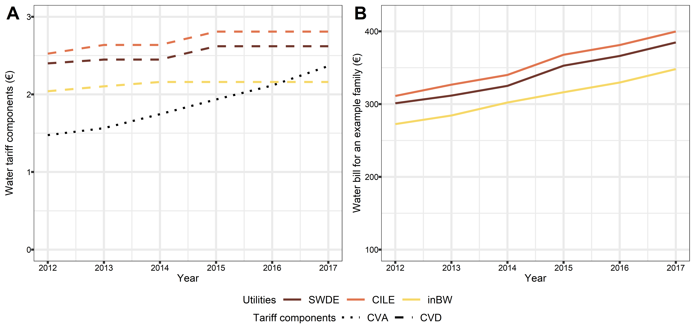
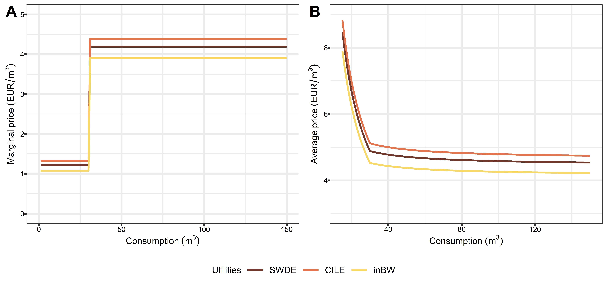
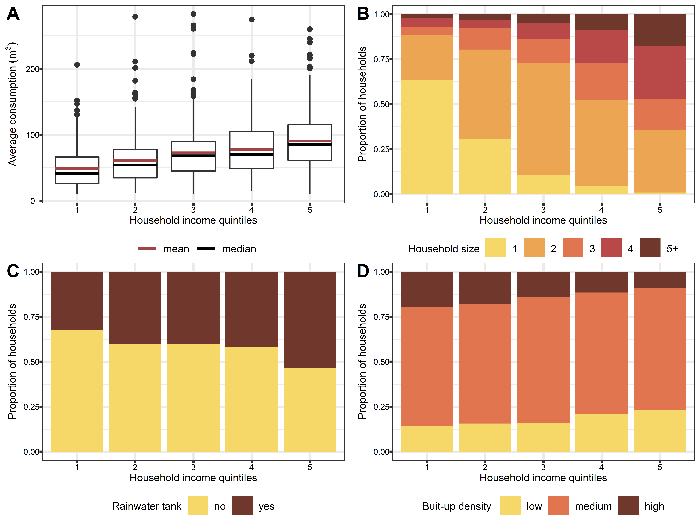
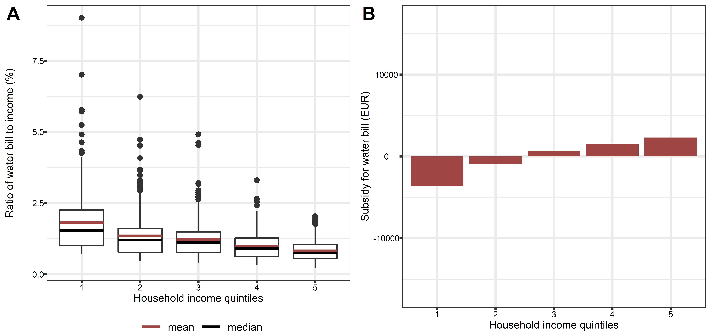
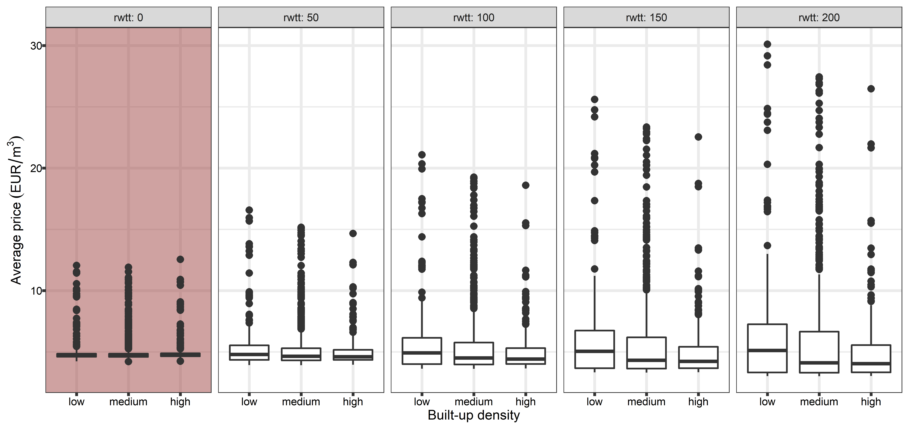
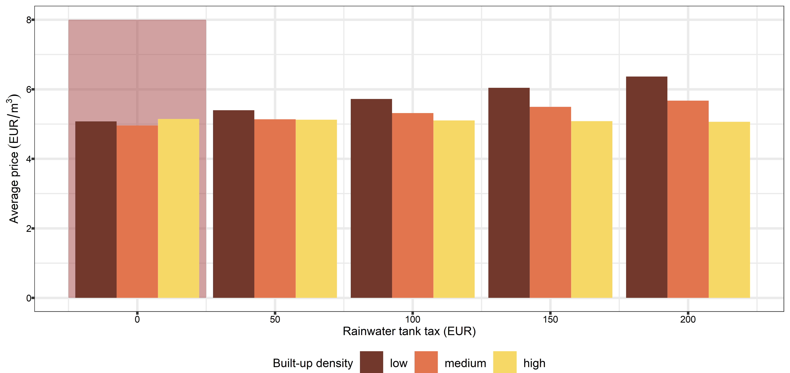
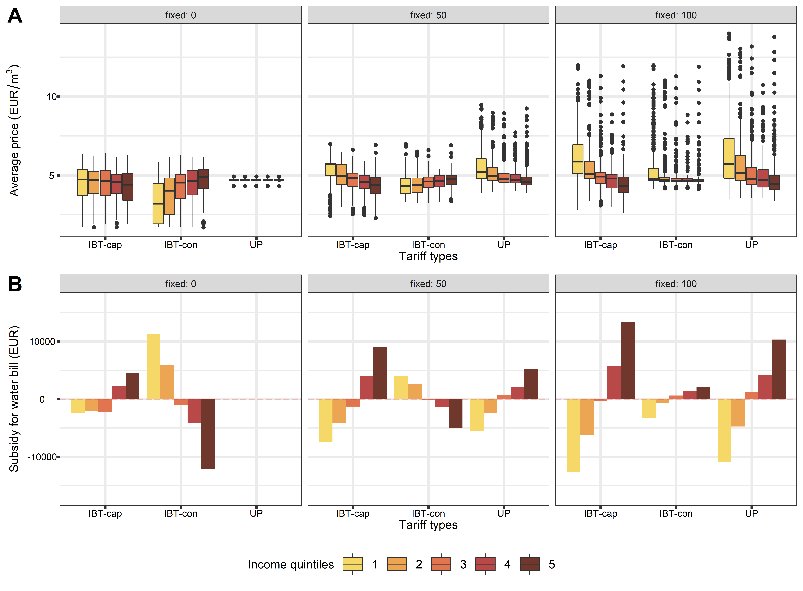

Redistribution effects of water tariffs
================
Nguyen Bich Ngoc, Jacques Teller
13 January 2022

<!-- -->
<table>
<thead>
<tr>
<th style="text-align:left;">
</th>
<th style="text-align:left;">
components
</th>
<th style="text-align:right;">
mean
</th>
<th style="text-align:right;">
sd
</th>
<th style="text-align:right;">
X0.
</th>
<th style="text-align:right;">
X25.
</th>
<th style="text-align:right;">
X50.
</th>
<th style="text-align:right;">
X75.
</th>
<th style="text-align:right;">
X100.
</th>
</tr>
</thead>
<tbody>
<tr>
<td style="text-align:left;">
fixedpc
</td>
<td style="text-align:left;">
fixedpc
</td>
<td style="text-align:right;">
42.2477053
</td>
<td style="text-align:right;">
21.1582293
</td>
<td style="text-align:right;">
8.4256732
</td>
<td style="text-align:right;">
25.3063671
</td>
<td style="text-align:right;">
36.5688283
</td>
<td style="text-align:right;">
56.9366554
</td>
<td style="text-align:right;">
89.1224984
</td>
</tr>
<tr>
<td style="text-align:left;">
volpc
</td>
<td style="text-align:left;">
volpc
</td>
<td style="text-align:right;">
57.4800075
</td>
<td style="text-align:right;">
21.1322581
</td>
<td style="text-align:right;">
10.7675390
</td>
<td style="text-align:right;">
42.7946796
</td>
<td style="text-align:right;">
63.1426726
</td>
<td style="text-align:right;">
74.4054907
</td>
<td style="text-align:right;">
91.2801227
</td>
</tr>
<tr>
<td style="text-align:left;">
fsapc
</td>
<td style="text-align:left;">
fsapc
</td>
<td style="text-align:right;">
0.2722872
</td>
<td style="text-align:right;">
0.0348113
</td>
<td style="text-align:right;">
0.1055832
</td>
<td style="text-align:right;">
0.2732136
</td>
<td style="text-align:right;">
0.2825452
</td>
<td style="text-align:right;">
0.2883638
</td>
<td style="text-align:right;">
0.3154574
</td>
</tr>
</tbody>
</table>

    ## Warning: Removed 150 row(s) containing missing values (geom_path).

    ## Warning: Removed 150 row(s) containing missing values (geom_path).

    ## Warning: Removed 192 row(s) containing missing values (geom_path).

<!-- -->

``` r
summary(df$TEH)
```

    ##    Min. 1st Qu.  Median    Mean 3rd Qu.    Max. 
    ##  0.2122  0.7290  1.0389  1.2432  1.5183  9.0135

``` r
sum(df$TEH > 3) * 100 / nrow(df)
```

    ## [1] 3.645833

``` r
## 3.2 by income quantiles -------

### income quantiles -------
```

<table>
<caption>
Household income quintile characteristics
</caption>
<thead>
<tr>
<th style="text-align:left;">
Quintile
</th>
<th style="text-align:right;">
Number of households
</th>
<th style="text-align:right;">
Average household size
</th>
<th style="text-align:right;">
Min income (EUR/month)
</th>
<th style="text-align:right;">
Max income (EUR/month)
</th>
</tr>
</thead>
<tbody>
<tr>
<td style="text-align:left;">
1
</td>
<td style="text-align:right;">
346
</td>
<td style="text-align:right;">
1.59
</td>
<td style="text-align:right;">
125
</td>
<td style="text-align:right;">
1750
</td>
</tr>
<tr>
<td style="text-align:left;">
2
</td>
<td style="text-align:right;">
346
</td>
<td style="text-align:right;">
2.01
</td>
<td style="text-align:right;">
1750
</td>
<td style="text-align:right;">
2250
</td>
</tr>
<tr>
<td style="text-align:left;">
3
</td>
<td style="text-align:right;">
346
</td>
<td style="text-align:right;">
2.38
</td>
<td style="text-align:right;">
2250
</td>
<td style="text-align:right;">
2750
</td>
</tr>
<tr>
<td style="text-align:left;">
4
</td>
<td style="text-align:right;">
345
</td>
<td style="text-align:right;">
2.80
</td>
<td style="text-align:right;">
2750
</td>
<td style="text-align:right;">
3750
</td>
</tr>
<tr>
<td style="text-align:left;">
5
</td>
<td style="text-align:right;">
345
</td>
<td style="text-align:right;">
3.35
</td>
<td style="text-align:right;">
3750
</td>
<td style="text-align:right;">
5250
</td>
</tr>
</tbody>
</table>


``` r
# Correlation between water consumption and household income should use spearman?????

cor.test(df$csmptv, df$income, method = "pearson")
```

    ## 
    ##  Pearson's product-moment correlation
    ## 
    ## data:  df$csmptv and df$income
    ## t = 15.729, df = 1726, p-value < 2.2e-16
    ## alternative hypothesis: true correlation is not equal to 0
    ## 95 percent confidence interval:
    ##  0.3121384 0.3946480
    ## sample estimates:
    ##      cor 
    ## 0.354082

``` r
cor.test(df$csmptv, df$income, method = "spearman")
```

    ## Warning in cor.test.default(df$csmptv, df$income, method = "spearman"):
    ## Cannot compute exact p-value with ties

    ## 
    ##  Spearman's rank correlation rho
    ## 
    ## data:  df$csmptv and df$income
    ## S = 536353649, p-value < 2.2e-16
    ## alternative hypothesis: true rho is not equal to 0
    ## sample estimates:
    ##       rho 
    ## 0.3763062

``` r
# Correlation between water consumption and income per equivalent adult should use spearman?????

cor.test(df$csmptv, df$inceqa, method = "pearson")
```

    ## 
    ##  Pearson's product-moment correlation
    ## 
    ## data:  df$csmptv and df$inceqa
    ## t = 1.4269, df = 1726, p-value = 0.1538
    ## alternative hypothesis: true correlation is not equal to 0
    ## 95 percent confidence interval:
    ##  -0.01285165  0.08134826
    ## sample estimates:
    ##        cor 
    ## 0.03432454

``` r
cor.test(df$csmptv, df$inceqa, method = "spearman")
```

    ## Warning in cor.test.default(df$csmptv, df$inceqa, method = "spearman"):
    ## Cannot compute exact p-value with ties

    ## 
    ##  Spearman's rank correlation rho
    ## 
    ## data:  df$csmptv and df$inceqa
    ## S = 803896839, p-value = 0.006707
    ## alternative hypothesis: true rho is not equal to 0
    ## sample estimates:
    ##        rho 
    ## 0.06519613

<!-- -->
<table>
<thead>
<tr>
<th style="text-align:left;">
incqnt
</th>
<th style="text-align:left;">
fixedpc_fn1
</th>
<th style="text-align:left;">
volpc_fn1
</th>
<th style="text-align:left;">
fsapc_fn1
</th>
<th style="text-align:left;">
fixedpc_fn2
</th>
<th style="text-align:left;">
volpc_fn2
</th>
<th style="text-align:left;">
fsapc_fn2
</th>
<th style="text-align:left;">
fixed
</th>
<th style="text-align:left;">
vol
</th>
<th style="text-align:left;">
fsa
</th>
</tr>
</thead>
<tbody>
<tr>
<td style="text-align:left;">
1
</td>
<td style="text-align:left;">
54.70
</td>
<td style="text-align:left;">
45.04
</td>
<td style="text-align:left;">
0.25
</td>
<td style="text-align:left;">
21.83
</td>
<td style="text-align:left;">
21.79
</td>
<td style="text-align:left;">
0.048
</td>
<td style="text-align:left;">
54.70±21.83
</td>
<td style="text-align:left;">
45.04±21.79
</td>
<td style="text-align:left;">
0.25±0.048
</td>
</tr>
<tr>
<td style="text-align:left;">
2
</td>
<td style="text-align:left;">
46.74
</td>
<td style="text-align:left;">
52.99
</td>
<td style="text-align:left;">
0.27
</td>
<td style="text-align:left;">
20.81
</td>
<td style="text-align:left;">
20.78
</td>
<td style="text-align:left;">
0.035
</td>
<td style="text-align:left;">
46.74±20.81
</td>
<td style="text-align:left;">
52.99±20.78
</td>
<td style="text-align:left;">
0.27±0.035
</td>
</tr>
<tr>
<td style="text-align:left;">
3
</td>
<td style="text-align:left;">
39.87
</td>
<td style="text-align:left;">
59.85
</td>
<td style="text-align:left;">
0.28
</td>
<td style="text-align:left;">
19.26
</td>
<td style="text-align:left;">
19.24
</td>
<td style="text-align:left;">
0.029
</td>
<td style="text-align:left;">
39.87±19.26
</td>
<td style="text-align:left;">
59.85±19.24
</td>
<td style="text-align:left;">
0.28±0.029
</td>
</tr>
<tr>
<td style="text-align:left;">
4
</td>
<td style="text-align:left;">
36.94
</td>
<td style="text-align:left;">
62.78
</td>
<td style="text-align:left;">
0.28
</td>
<td style="text-align:left;">
18.04
</td>
<td style="text-align:left;">
18.02
</td>
<td style="text-align:left;">
0.022
</td>
<td style="text-align:left;">
36.94±18.04
</td>
<td style="text-align:left;">
62.78±18.02
</td>
<td style="text-align:left;">
0.28±0.022
</td>
</tr>
<tr>
<td style="text-align:left;">
5
</td>
<td style="text-align:left;">
32.95
</td>
<td style="text-align:left;">
66.77
</td>
<td style="text-align:left;">
0.28
</td>
<td style="text-align:left;">
18.47
</td>
<td style="text-align:left;">
18.44
</td>
<td style="text-align:left;">
0.028
</td>
<td style="text-align:left;">
32.95±18.47
</td>
<td style="text-align:left;">
66.77±18.44
</td>
<td style="text-align:left;">
0.28±0.028
</td>
</tr>
</tbody>
</table>
<table>
<thead>
<tr>
<th style="text-align:left;">
incqnt
</th>
<th style="text-align:right;">
tehprop
</th>
</tr>
</thead>
<tbody>
<tr>
<td style="text-align:left;">
1
</td>
<td style="text-align:right;">
12.7167630
</td>
</tr>
<tr>
<td style="text-align:left;">
2
</td>
<td style="text-align:right;">
3.7572254
</td>
</tr>
<tr>
<td style="text-align:left;">
3
</td>
<td style="text-align:right;">
1.4450867
</td>
</tr>
<tr>
<td style="text-align:left;">
4
</td>
<td style="text-align:right;">
0.2898551
</td>
</tr>
<tr>
<td style="text-align:left;">
5
</td>
<td style="text-align:right;">
0.0000000
</td>
</tr>
</tbody>
</table>

    ## Warning: Graphs cannot be horizontally aligned unless the axis parameter
    ## is set. Placing graphs unaligned.

<!-- -->

``` r
summary(df$avrprc)
```

    ##    Min. 1st Qu.  Median    Mean 3rd Qu.    Max. 
    ##   4.200   4.595   4.690   5.000   4.850  12.549

``` r
summary(df$avrprc[df$inccat == "precarious"])
```

    ##    Min. 1st Qu.  Median    Mean 3rd Qu.    Max.    NA's 
    ##   4.222   4.605   4.734   5.152   4.915  10.592       1

``` r
summary(df$subs[df$inccat == "precarious"])
```

    ##     Min.  1st Qu.   Median     Mean  3rd Qu.     Max.     NA's 
    ## -68.1035  -4.7756   0.5658  -4.0094   8.3744  27.4910        1

``` r
summary(df$mgnprc)
```

    ##    Min. 1st Qu.  Median    Mean 3rd Qu.    Max. 
    ##   1.158   4.458   4.458   3.982   4.458   4.658

``` r
summary(df$mgnprc[df$inccat == "precarious"])
```

    ##    Min. 1st Qu.  Median    Mean 3rd Qu.    Max.    NA's 
    ##   1.158   4.153   4.458   3.754   4.458   4.658       1

``` r
## 3.5. changing fixed  -----

### new cvd ------
```

<table>
<thead>
<tr>
<th style="text-align:right;">
CVD_SWDE
</th>
<th style="text-align:right;">
CVD_CILE
</th>
<th style="text-align:right;">
CVD_inBW
</th>
<th style="text-align:right;">
CVA
</th>
<th style="text-align:left;">
scenario
</th>
<th style="text-align:right;">
fixed
</th>
<th style="text-align:right;">
rwtt
</th>
<th style="text-align:right;">
mgpr_bl1
</th>
<th style="text-align:right;">
mgpr_bl2
</th>
</tr>
</thead>
<tbody>
<tr>
<td style="text-align:right;">
2.4480
</td>
<td style="text-align:right;">
2.6366
</td>
<td style="text-align:right;">
2.1600
</td>
<td style="text-align:right;">
1.745
</td>
<td style="text-align:left;">
As in 2014
</td>
<td style="text-align:right;">
101.438
</td>
<td style="text-align:right;">
0
</td>
<td style="text-align:right;">
1.2272
</td>
<td style="text-align:right;">
4.1994
</td>
</tr>
<tr>
<td style="text-align:right;">
4.2744
</td>
<td style="text-align:right;">
4.5442
</td>
<td style="text-align:right;">
3.6839
</td>
<td style="text-align:right;">
1.745
</td>
<td style="text-align:left;">
1
</td>
<td style="text-align:right;">
0.000
</td>
<td style="text-align:right;">
0
</td>
<td style="text-align:right;">
2.1344
</td>
<td style="text-align:right;">
6.0138
</td>
</tr>
<tr>
<td style="text-align:right;">
3.3730
</td>
<td style="text-align:right;">
3.6365
</td>
<td style="text-align:right;">
2.8864
</td>
<td style="text-align:right;">
1.745
</td>
<td style="text-align:left;">
2
</td>
<td style="text-align:right;">
50.000
</td>
<td style="text-align:right;">
0
</td>
<td style="text-align:right;">
1.6875
</td>
<td style="text-align:right;">
5.1200
</td>
</tr>
<tr>
<td style="text-align:right;">
2.4716
</td>
<td style="text-align:right;">
2.7289
</td>
<td style="text-align:right;">
2.0890
</td>
<td style="text-align:right;">
1.745
</td>
<td style="text-align:left;">
3
</td>
<td style="text-align:right;">
100.000
</td>
<td style="text-align:right;">
0
</td>
<td style="text-align:right;">
1.2406
</td>
<td style="text-align:right;">
4.2262
</td>
</tr>
<tr>
<td style="text-align:right;">
1.5702
</td>
<td style="text-align:right;">
1.8212
</td>
<td style="text-align:right;">
1.2916
</td>
<td style="text-align:right;">
1.745
</td>
<td style="text-align:left;">
4
</td>
<td style="text-align:right;">
150.000
</td>
<td style="text-align:right;">
0
</td>
<td style="text-align:right;">
0.7937
</td>
<td style="text-align:right;">
3.3324
</td>
</tr>
<tr>
<td style="text-align:right;">
0.6688
</td>
<td style="text-align:right;">
0.9135
</td>
<td style="text-align:right;">
0.4942
</td>
<td style="text-align:right;">
1.745
</td>
<td style="text-align:left;">
5
</td>
<td style="text-align:right;">
200.000
</td>
<td style="text-align:right;">
0
</td>
<td style="text-align:right;">
0.3468
</td>
<td style="text-align:right;">
2.4386
</td>
</tr>
</tbody>
</table>

<!-- -->

<table>
<thead>
<tr>
<th style="text-align:right;">
CVD_SWDE
</th>
<th style="text-align:right;">
CVD_CILE
</th>
<th style="text-align:right;">
CVD_inBW
</th>
<th style="text-align:right;">
CVA
</th>
<th style="text-align:right;">
scenario
</th>
<th style="text-align:right;">
fixed
</th>
<th style="text-align:right;">
rwtt
</th>
<th style="text-align:right;">
mgpr_bl1
</th>
<th style="text-align:right;">
mgpr_bl2
</th>
</tr>
</thead>
<tbody>
<tr>
<td style="text-align:right;">
2.4480
</td>
<td style="text-align:right;">
2.6366
</td>
<td style="text-align:right;">
2.1600
</td>
<td style="text-align:right;">
1.745
</td>
<td style="text-align:right;">
6
</td>
<td style="text-align:right;">
101.4380
</td>
<td style="text-align:right;">
0
</td>
<td style="text-align:right;">
1.2272
</td>
<td style="text-align:right;">
4.1994
</td>
</tr>
<tr>
<td style="text-align:right;">
2.1517
</td>
<td style="text-align:right;">
2.4683
</td>
<td style="text-align:right;">
1.8852
</td>
<td style="text-align:right;">
1.745
</td>
<td style="text-align:right;">
7
</td>
<td style="text-align:right;">
95.9578
</td>
<td style="text-align:right;">
50
</td>
<td style="text-align:right;">
1.0902
</td>
<td style="text-align:right;">
3.9254
</td>
</tr>
<tr>
<td style="text-align:right;">
1.8554
</td>
<td style="text-align:right;">
2.3000
</td>
<td style="text-align:right;">
1.6104
</td>
<td style="text-align:right;">
1.745
</td>
<td style="text-align:right;">
8
</td>
<td style="text-align:right;">
90.4777
</td>
<td style="text-align:right;">
100
</td>
<td style="text-align:right;">
0.9532
</td>
<td style="text-align:right;">
3.6514
</td>
</tr>
<tr>
<td style="text-align:right;">
1.5591
</td>
<td style="text-align:right;">
2.1318
</td>
<td style="text-align:right;">
1.3356
</td>
<td style="text-align:right;">
1.745
</td>
<td style="text-align:right;">
9
</td>
<td style="text-align:right;">
84.9975
</td>
<td style="text-align:right;">
150
</td>
<td style="text-align:right;">
0.8162
</td>
<td style="text-align:right;">
3.3774
</td>
</tr>
<tr>
<td style="text-align:right;">
1.2628
</td>
<td style="text-align:right;">
1.9635
</td>
<td style="text-align:right;">
1.0608
</td>
<td style="text-align:right;">
1.745
</td>
<td style="text-align:right;">
10
</td>
<td style="text-align:right;">
79.5174
</td>
<td style="text-align:right;">
200
</td>
<td style="text-align:right;">
0.6792
</td>
<td style="text-align:right;">
3.1034
</td>
</tr>
</tbody>
</table>

<!-- -->
<!-- -->
<!-- -->

<table>
<thead>
<tr>
<th style="text-align:right;">
bl1_SWDE
</th>
<th style="text-align:right;">
bl1_CILE
</th>
<th style="text-align:right;">
bl1_inBW
</th>
<th style="text-align:right;">
fixed
</th>
<th style="text-align:right;">
revincr
</th>
<th style="text-align:right;">
mgpr_bl1
</th>
<th style="text-align:right;">
mgpr_bl2
</th>
</tr>
</thead>
<tbody>
<tr>
<td style="text-align:right;">
4.427231
</td>
<td style="text-align:right;">
4.635599
</td>
<td style="text-align:right;">
4.069370
</td>
<td style="text-align:right;">
0
</td>
<td style="text-align:right;">
0.0
</td>
<td style="text-align:right;">
4.431018
</td>
<td style="text-align:right;">
4.431018
</td>
</tr>
<tr>
<td style="text-align:right;">
3.710676
</td>
<td style="text-align:right;">
3.914732
</td>
<td style="text-align:right;">
3.423071
</td>
<td style="text-align:right;">
50
</td>
<td style="text-align:right;">
0.0
</td>
<td style="text-align:right;">
3.719586
</td>
<td style="text-align:right;">
3.719586
</td>
</tr>
<tr>
<td style="text-align:right;">
2.994121
</td>
<td style="text-align:right;">
3.193866
</td>
<td style="text-align:right;">
2.776773
</td>
<td style="text-align:right;">
100
</td>
<td style="text-align:right;">
0.0
</td>
<td style="text-align:right;">
3.008154
</td>
<td style="text-align:right;">
3.008154
</td>
</tr>
<tr>
<td style="text-align:right;">
4.871204
</td>
<td style="text-align:right;">
5.100408
</td>
<td style="text-align:right;">
4.477557
</td>
<td style="text-align:right;">
0
</td>
<td style="text-align:right;">
0.1
</td>
<td style="text-align:right;">
4.875369
</td>
<td style="text-align:right;">
4.875369
</td>
</tr>
<tr>
<td style="text-align:right;">
4.154649
</td>
<td style="text-align:right;">
4.379542
</td>
<td style="text-align:right;">
3.831259
</td>
<td style="text-align:right;">
50
</td>
<td style="text-align:right;">
0.1
</td>
<td style="text-align:right;">
4.163938
</td>
<td style="text-align:right;">
4.163938
</td>
</tr>
<tr>
<td style="text-align:right;">
3.438094
</td>
<td style="text-align:right;">
3.658676
</td>
<td style="text-align:right;">
3.184960
</td>
<td style="text-align:right;">
100
</td>
<td style="text-align:right;">
0.1
</td>
<td style="text-align:right;">
3.452506
</td>
<td style="text-align:right;">
3.452506
</td>
</tr>
<tr>
<td style="text-align:right;">
5.315177
</td>
<td style="text-align:right;">
5.565218
</td>
<td style="text-align:right;">
4.885744
</td>
<td style="text-align:right;">
0
</td>
<td style="text-align:right;">
0.2
</td>
<td style="text-align:right;">
5.319721
</td>
<td style="text-align:right;">
5.319721
</td>
</tr>
<tr>
<td style="text-align:right;">
4.598622
</td>
<td style="text-align:right;">
4.844352
</td>
<td style="text-align:right;">
4.239446
</td>
<td style="text-align:right;">
50
</td>
<td style="text-align:right;">
0.2
</td>
<td style="text-align:right;">
4.608289
</td>
<td style="text-align:right;">
4.608289
</td>
</tr>
<tr>
<td style="text-align:right;">
3.882067
</td>
<td style="text-align:right;">
4.123486
</td>
<td style="text-align:right;">
3.593147
</td>
<td style="text-align:right;">
100
</td>
<td style="text-align:right;">
0.2
</td>
<td style="text-align:right;">
3.896857
</td>
<td style="text-align:right;">
3.896857
</td>
</tr>
</tbody>
</table>
<table>
<thead>
<tr>
<th style="text-align:right;">
bl1_SWDE
</th>
<th style="text-align:right;">
bl1_CILE
</th>
<th style="text-align:right;">
bl1_inBW
</th>
<th style="text-align:right;">
fixed
</th>
<th style="text-align:right;">
revincr
</th>
<th style="text-align:right;">
mgpr_bl1
</th>
<th style="text-align:right;">
mgpr_bl2
</th>
</tr>
</thead>
<tbody>
<tr>
<td style="text-align:right;">
1.789001
</td>
<td style="text-align:right;">
1.876093
</td>
<td style="text-align:right;">
1.594286
</td>
<td style="text-align:right;">
0
</td>
<td style="text-align:right;">
0.0
</td>
<td style="text-align:right;">
1.786848
</td>
<td style="text-align:right;">
6.253969
</td>
</tr>
<tr>
<td style="text-align:right;">
1.499448
</td>
<td style="text-align:right;">
1.584348
</td>
<td style="text-align:right;">
1.341081
</td>
<td style="text-align:right;">
50
</td>
<td style="text-align:right;">
0.0
</td>
<td style="text-align:right;">
1.499952
</td>
<td style="text-align:right;">
5.249832
</td>
</tr>
<tr>
<td style="text-align:right;">
1.209895
</td>
<td style="text-align:right;">
1.292603
</td>
<td style="text-align:right;">
1.087876
</td>
<td style="text-align:right;">
100
</td>
<td style="text-align:right;">
0.0
</td>
<td style="text-align:right;">
1.213056
</td>
<td style="text-align:right;">
4.245695
</td>
</tr>
<tr>
<td style="text-align:right;">
1.968406
</td>
<td style="text-align:right;">
2.064208
</td>
<td style="text-align:right;">
1.754204
</td>
<td style="text-align:right;">
0
</td>
<td style="text-align:right;">
0.1
</td>
<td style="text-align:right;">
1.966037
</td>
<td style="text-align:right;">
6.881130
</td>
</tr>
<tr>
<td style="text-align:right;">
1.678853
</td>
<td style="text-align:right;">
1.772463
</td>
<td style="text-align:right;">
1.500999
</td>
<td style="text-align:right;">
50
</td>
<td style="text-align:right;">
0.1
</td>
<td style="text-align:right;">
1.679141
</td>
<td style="text-align:right;">
5.876993
</td>
</tr>
<tr>
<td style="text-align:right;">
1.389300
</td>
<td style="text-align:right;">
1.480718
</td>
<td style="text-align:right;">
1.247794
</td>
<td style="text-align:right;">
100
</td>
<td style="text-align:right;">
0.1
</td>
<td style="text-align:right;">
1.392245
</td>
<td style="text-align:right;">
4.872856
</td>
</tr>
<tr>
<td style="text-align:right;">
2.147811
</td>
<td style="text-align:right;">
2.252323
</td>
<td style="text-align:right;">
1.914122
</td>
<td style="text-align:right;">
0
</td>
<td style="text-align:right;">
0.2
</td>
<td style="text-align:right;">
2.145226
</td>
<td style="text-align:right;">
7.508291
</td>
</tr>
<tr>
<td style="text-align:right;">
1.858259
</td>
<td style="text-align:right;">
1.960578
</td>
<td style="text-align:right;">
1.660917
</td>
<td style="text-align:right;">
50
</td>
<td style="text-align:right;">
0.2
</td>
<td style="text-align:right;">
1.858330
</td>
<td style="text-align:right;">
6.504154
</td>
</tr>
<tr>
<td style="text-align:right;">
1.568706
</td>
<td style="text-align:right;">
1.668834
</td>
<td style="text-align:right;">
1.407712
</td>
<td style="text-align:right;">
100
</td>
<td style="text-align:right;">
0.2
</td>
<td style="text-align:right;">
1.571433
</td>
<td style="text-align:right;">
5.500017
</td>
</tr>
</tbody>
</table>
<table>
<thead>
<tr>
<th style="text-align:right;">
bl1_SWDE
</th>
<th style="text-align:right;">
bl1_CILE
</th>
<th style="text-align:right;">
bl1_inBW
</th>
<th style="text-align:right;">
fixed
</th>
<th style="text-align:right;">
revincr
</th>
<th style="text-align:right;">
mgpr_bl1
</th>
<th style="text-align:right;">
mgpr_bl2
</th>
</tr>
</thead>
<tbody>
<tr>
<td style="text-align:right;">
1.816621
</td>
<td style="text-align:right;">
1.870233
</td>
<td style="text-align:right;">
1.608886
</td>
<td style="text-align:right;">
0
</td>
<td style="text-align:right;">
0.0
</td>
<td style="text-align:right;">
1.808024
</td>
<td style="text-align:right;">
6.328085
</td>
</tr>
<tr>
<td style="text-align:right;">
1.522598
</td>
<td style="text-align:right;">
1.579399
</td>
<td style="text-align:right;">
1.353362
</td>
<td style="text-align:right;">
50
</td>
<td style="text-align:right;">
0.0
</td>
<td style="text-align:right;">
1.517698
</td>
<td style="text-align:right;">
5.311944
</td>
</tr>
<tr>
<td style="text-align:right;">
1.228575
</td>
<td style="text-align:right;">
1.288566
</td>
<td style="text-align:right;">
1.097838
</td>
<td style="text-align:right;">
100
</td>
<td style="text-align:right;">
0.0
</td>
<td style="text-align:right;">
1.227372
</td>
<td style="text-align:right;">
4.295803
</td>
</tr>
<tr>
<td style="text-align:right;">
1.998797
</td>
<td style="text-align:right;">
2.057760
</td>
<td style="text-align:right;">
1.770269
</td>
<td style="text-align:right;">
0
</td>
<td style="text-align:right;">
0.1
</td>
<td style="text-align:right;">
1.989337
</td>
<td style="text-align:right;">
6.962678
</td>
</tr>
<tr>
<td style="text-align:right;">
1.704773
</td>
<td style="text-align:right;">
1.766927
</td>
<td style="text-align:right;">
1.514745
</td>
<td style="text-align:right;">
50
</td>
<td style="text-align:right;">
0.1
</td>
<td style="text-align:right;">
1.699011
</td>
<td style="text-align:right;">
5.946537
</td>
</tr>
<tr>
<td style="text-align:right;">
1.410750
</td>
<td style="text-align:right;">
1.476093
</td>
<td style="text-align:right;">
1.259221
</td>
<td style="text-align:right;">
100
</td>
<td style="text-align:right;">
0.1
</td>
<td style="text-align:right;">
1.408685
</td>
<td style="text-align:right;">
4.930397
</td>
</tr>
<tr>
<td style="text-align:right;">
2.180972
</td>
<td style="text-align:right;">
2.245288
</td>
<td style="text-align:right;">
1.931651
</td>
<td style="text-align:right;">
0
</td>
<td style="text-align:right;">
0.2
</td>
<td style="text-align:right;">
2.170649
</td>
<td style="text-align:right;">
7.597272
</td>
</tr>
<tr>
<td style="text-align:right;">
1.886948
</td>
<td style="text-align:right;">
1.954454
</td>
<td style="text-align:right;">
1.676128
</td>
<td style="text-align:right;">
50
</td>
<td style="text-align:right;">
0.2
</td>
<td style="text-align:right;">
1.880323
</td>
<td style="text-align:right;">
6.581131
</td>
</tr>
<tr>
<td style="text-align:right;">
1.592925
</td>
<td style="text-align:right;">
1.663621
</td>
<td style="text-align:right;">
1.420604
</td>
<td style="text-align:right;">
100
</td>
<td style="text-align:right;">
0.2
</td>
<td style="text-align:right;">
1.589997
</td>
<td style="text-align:right;">
5.564990
</td>
</tr>
</tbody>
</table>

<!-- -->
<!-- -->
